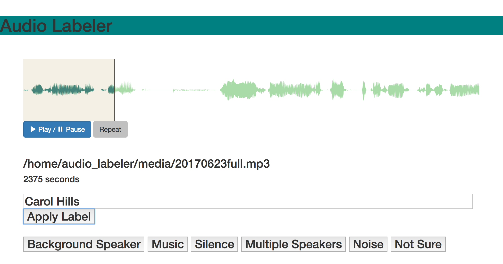

# Audio Labeler

First, install [Docker CE](https://www.docker.com/community-edition) and/or [Docker Toolbox](https://www.docker.com/products/docker-toolbox).




Open a new terminal window and enter the following commands to kill the current Docker container (if running), then download and launch the latest container build.

```
docker rm -f audio_labeler

docker pull hipstas/audio-labeler

docker run -it -d --name audio_labeler -p 8000:8000 -v ~/Desktop/audio_labeler:/home/audio_labeler hipstas/audio-labeler bash
```
Move some audio files (MP3 or WAV) into the newly created folder `~/Desktop/audio_labeler/media/`. The application will recursively find files in subdirectories.

In the terminal, re-enter the following three commands to relaunch the Audio Labeler application. Audio files are only detected when the Flask application is launched.

```
docker rm -f audio_labeler

docker pull hipstas/audio-labeler

docker run -it -d --name audio_labeler -p 8000:8000 -v ~/Desktop/audio_labeler:/home/audio_labeler hipstas/audio-labeler bash
```

Point your browser to [localhost:8000](localhost:8000) and begin labeling. The application will output all data to the file `output_table.csv` in the `audio_labeler` directory. You can download the current CSV at any time using a link provided in the interface.
